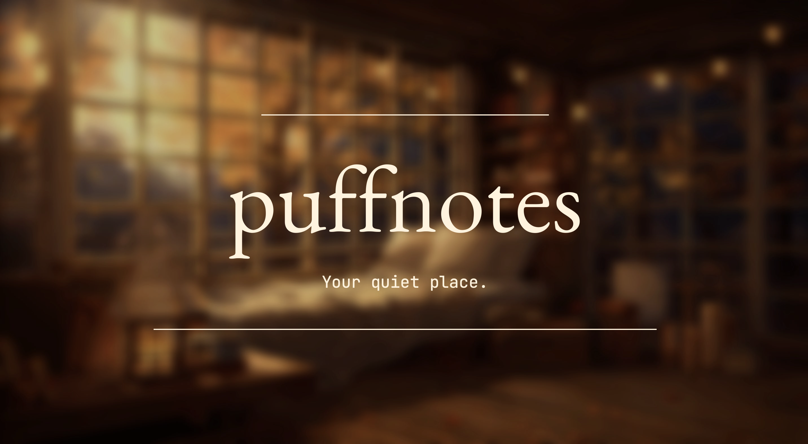

# puffnotes  
### *The coziest way to write notes — even if you barely write at all.*

---

## 💭 What is Puffnotes?

**Puffnotes** is a minimalist, local-first, markdown-based note-taking app with one simple goal:

> ✨ Make your messy, vague ideas look smart and structured — in one click.

Built for *lazy writers, distracted students, and tired creatives*, Puffnotes is quiet, beautiful, and powered by Groq’s lightning-fast AI to help you go from **rough thought → finished note** in seconds.

---

## 🌟 Key Features

### ✨ **The Magic Wand (AI Beautify)**
Write anything — even half-finished fragments — and hit the ✨ wand button. Puffnotes uses AI to:
- Expand your ideas
- Reorganize thoughts
- Format content like a pro
- Turn rough outlines into full, usable notes

It’s your personal thought polisher.

---

### 💾 **Truly Local. Truly Yours.**
- Files are saved directly to your system as `.md` files
- **No cloud. No account. No internet needed** after initial load
- Your thoughts stay on your machine, unless you choose to beautify

---

### 🪄 **Autosaves Without a Fuss**
- On first save, choose a folder
- From then on, Puffnotes quietly autosaves your work
- Filename updates automatically without overwriting existing ones

---

### 🧘‍♂️ **Minimal, Calm UI**
- 🧊 Glassmorphism interface with soft animations
- 🪶 Focus mode for distraction-free writing
- 🗂 Floating FAB-style buttons for save, folder, wand, and toggle

---

### 🧠 **Markdown-Based Simplicity**
- Every note is a simple `.md` file
- Compatible with Obsidian, VS Code, GitHub — anything that reads markdown

---

## 🧑‍💻 Who is this for?

- 🧠 **Students** tired of copying notes manually  
- ✍️ **Writers** looking for a distraction-free scratchpad  
- ⚡ **Coders & tinkerers** who love offline-first apps  
- 🌙 **Late-night thinkers** who just want to dump thoughts without fuss  
- 😩 **Anyone who feels lazy... but still wants to feel productive**

---

## 🛠️ How to Use

1. **Run the app locally (via browser)**  
2. **Pick a folder** → All your notes go there  
3. **Start typing**  
4. **Click the ✨ wand** to beautify the mess  
5. **Autosave takes care of the rest**

> You can even close the app and reopen later — it reads directly from your folder.

---

## 📌 Roadmap

- [ ] PDF export  
- [ ] Theming (dark mode, sepia, retro)  
- [ ] Embeddable AI prompts  
- [ ] Drag-and-drop image support  
- [ ] Tag + folder organization

---

## 🖼️ Credits

- 🎞️ Background video: [MoeWalls](https://moewalls.com/)

---

## 🚀 Dreamy, Simple, and Actually Useful

Puffnotes isn’t just minimal — it’s *magical*.  
Built for people who don’t want another productivity system — just a space to **think, write, and let AI do the rest.**

---

